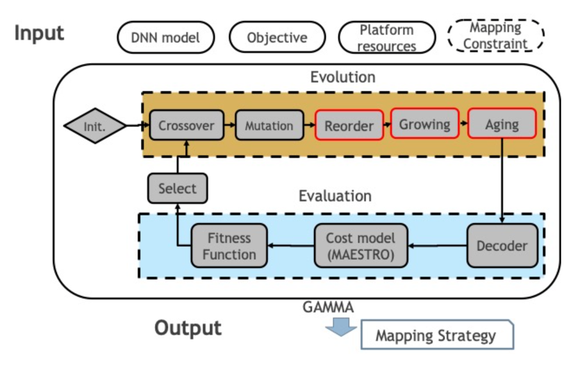

---
title: "GAMMA: Automating the HW Mapping of DNN Models on Accelerators via Genetic Algorithm"
collection: talks
type: "Projects"
permalink: /talks/1-gamma
venue: "ICCAD'20"
date: 2020-07-02
location: "Atlanta, GA"
--- 
### Abstract
DNN accelerators provide efficiency by leveraging reuse of activations/weights/outputs during the DNN computations to reduce data movement from DRAM to the chip. The reuse is captured by the accelerator's dataflow. While there has been significant prior work in exploring and comparing various dataflows, the strategy for assigning on-chip hardware resources (i.e., compute and memory) given a dataflow that can optimize for performance/energy while meeting platform constraints of area/power for DNN(s) of interest is still relatively unexplored. The design-space of choices for balancing compute and memory explodes combinatorially, as we show in this work (e.g., as large as O(10^(72)) choices for running \mobilenet), making it infeasible to do manual-tuning via exhaustive searches. It is also difficult to come up with a specific heuristic given that different DNNs and layer types exhibit different amounts of reuse.
In this paper, we propose an autonomous strategy called ConfuciuX to find optimized HW resource assignments for a given model and dataflow style. ConfuciuX leverages a reinforcement learning method, REINFORCE, to guide the search process, leveraging a detailed HW performance cost model within the training loop to estimate rewards. We also augment the RL approach with a genetic algorithm for further fine-tuning. ConfuciuX demonstrates the highest sample-efficiency for training compared to other techniques such as Bayesian optimization, genetic algorithm, simulated annealing, and other RL methods. It converges to the optimized hardware configuration 4.7 to 24 times faster than alternate techniques.

------
### Code Available
[GAMMA-MAESTRO](https://github.com/maestro-project/gamma)

[GAMMA-Timeloop](https://github.com/maestro-project/gamma-timeloop)

------------
### [Youtube]((https://www.youtube.com/watch?v=i8h9lZOjarc))

----------
### Paper: [GAMMA: automating the HW mapping of DNN models on accelerators via genetic algorithm](https://dl.acm.org/doi/10.1145/3400302.3415639)