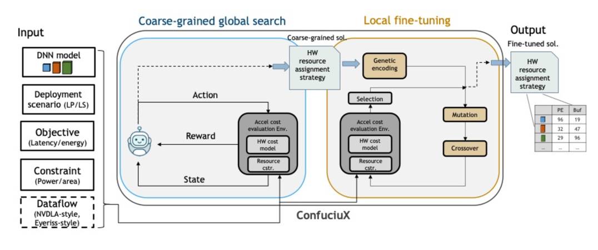

---
title: "ConfuciuX: Autonomous Hardware Resource Assignment for DNN Accelerators using Reinforcement Learning"
collection: talks
type: "RL, ML, Architecture, Baesian Optimization, Simulated Annealing, Genetic Algorithm, PyTorch, Tensorflow, Open-source release"
permalink: /talks/2-confuciux
venue: "MICRO'20"
date: 2020-05-01
location: "Atlanta, GA"
--- 
### Abstract
DNN layers are multi-dimensional loops that can be ordered, tiled, and scheduled in myriad ways across space and time on DNN accelerators. Each of these choices is called a mapping. It has been shown that the mapping plays an extremely crucial role in overall performance and efficiency, as it directly determines the amount of reuse that the accelerator can leverage from the DNN. Moreover, instead of using a fixed mapping for every DNN layer, research has revealed the benefit of optimizing per-layer mappings. However, determining the right mapping, given an accelerator and layer is still an open question. The immense space of mappings (or map-space) makes brute-forced exhaustive search methods unapproachable. In this paper, we propose a domain-specific genetic algorithm-based method, GAMMA, which is specially designed for this HW-mapping problem. In contrast to prior works that either target simple rigid accelerators with a limited map-space or choose from a restricted set of mappings, we construct an extremely flexible map-space and show that GAMMA can explore the space and determine an optimized mapping with high sample efficiency. We quantitatively compare GAMMA with many popular optimization methods and observe GAMMA consistently finds better solutions.

----

### Code Available
[ConfuciuX Code-base](https://github.com/maestro-project/confuciux)

----
### [Youtube]((https://www.youtube.com/watch?v=VOZMVI3xOIo))

------
### Paper: [ConfuciuX: Autonomous Hardware Resource Assignment for DNN Accelerators using Reinforcement Learning](https://arxiv.org/abs/2009.02010)
