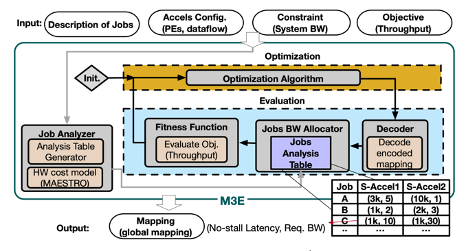

---
title: "MAGMA: An Optimization Framework for Mapping Multiple DNNs on Multiple Accelerator Cores"
collection: talks
type: "Heterogenous, Scheduling, Multi-core, multi-tenancy, Genetic Algorithm, Performance modeling"
permalink: /talks/3-magma
venue: "HPCA'22"
date: 2022-04-28
location: "Atlanta, GA"
--- 
### Abstract
As Deep Learning continues to drive a variety of
applications in edge and cloud data centers, there is a growing
trend towards building large accelerators with several subaccelerator cores/chiplets. This work looks at the problem of
supporting multi-tenancy on such accelerators. In particular,
we focus on the problem of mapping jobs from several DNNs
simultaneously on an accelerator. Given the extremely large
search space, we formulate the search as an optimization problem and develop an optimization framework called M3E. In
addition, we develop a specialized optimization algorithm called
MAGMA with custom operators to enable structured sampleefficient exploration. We quantitatively compare MAGMA
with several state-of-the-art methods, black-box optimization,
and reinforcement learning methods across different accelerator settings (large/small accelerators) and different subaccelerator configurations (homogeneous/heterogeneous), and
observe MAGMA can consistently find better mappings.

----
### Code Available
[MAGMA Code-base](https://github.com/maestro-project/magma)

------
### [Youtube]((https://www.youtube.com/watch?v=8ZwTBlAswGA))

-----------
### Paper: [MAGMA: An Optimization Framework for Mapping Multiple DNNs on Multiple Accelerator Cores](https://arxiv.org/abs/2104.13997)
