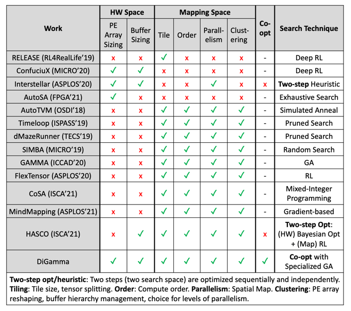

---
title: "DiGamma: Domain-aware Genetic Algorithm for HW-Mapping Co-optimization for DNN Accelerators"
collection: talks
type: "Projects"
permalink: /talks/5-flexion
venue: "SIGMETRICS'22"
date: 2022-06-09
location: "Atlanta, GA"
--- 
### Abstract
The design of DNN accelerators includes two key parts: HW resource configuration and mapping strategy. Intensive research has been conducted to optimize each of them independently. Unfortunately, optimizing for both together is extremely challenging due to the extremely large cross-coupled search space. To address this, in this paper, we propose a HW-Mapping co-optimization framework, an efficient encoding of the immense design space constructed by HW and Mapping, and a domain-aware genetic algorithm, named DiGamma, with specialized operators for improving search efficiency. We evaluate DiGamma with seven popular DNNs models with different properties. Our evaluations show DiGamma can achieve (geomean) 3.0x and 10.0x speedup, comparing to the best-performing baseline optimization algorithms, in edge and cloud settings.

----
### Code Available
[DiGamma Code-base](https://github.com/maestro-project/digamma)

------
### [Youtube]((https://www.youtube.com/watch?v=OeVgtZR_L4w))

-----------
### Paper: [DiGamma: Domain-aware Genetic Algorithm for HW-Mapping Co-optimization for DNN Accelerators]( https://arxiv.org/abs/2201.11220)