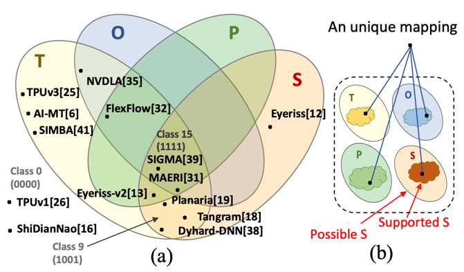

---
title: "A Formalism of DNN Accelerator Flexibility"
collection: talks
type: "Projects"
permalink: /talks/5-flexion
venue: "SIGMETRICS'22"
date: 2022-06-06
location: "Atlanta, GA"
--- 
### Abstract
The high efficiency of domain-specific hardware accelerators for machine learning (ML) has come from specialization, with the trade-off of less configurability/ flexibility. There is growing interest in developing flexible ML accelerators to make them future-proof to the rapid evolution of Deep Neural Networks (DNNs). However, the notion of accelerator flexibility has always been used in an informal manner, restricting computer architects from conducting systematic apples-to-apples design-space exploration (DSE) across trillions of choices. In this work, we formally define accelerator flexibility and show how it can be integrated for DSE. Specifically, we capture DNN accelerator flexibility across four axes: tiling, ordering, parallelization, and array shape. We categorize existing accelerators into 16 classes based on their axes of flexibility support, and define a precise quantification of the degree of flexibility of an accelerator across each axis. We leverage these to develop a novel flexibility-aware DSE framework. We demonstrate how this can be used to perform first-of-their-kind evaluations, including an isolation study to identify the individual impact of the flexibility axes. We demonstrate that adding flexibility features to a hypothetical DNN accelerator designed in 2014 improves runtime on future (i.e., present-day) DNNs by 11.8x geomean.

----
### Code Available
[Enabled by extended version of Gamma](https://github.com/maestro-project/gamma/tree/master/src/GAMMA#advanced-usage-constrained-map-space-exploration)

------
### [Youtube]((https://www.youtube.com/watch?v=ZuQLgxssSnM))

-----------
### Paper: [DiGamma: Domain-aware Genetic Algorithm for HW-Mapping Co-optimization for DNN Accelerators]( https://arxiv.org/abs/2201.11220)