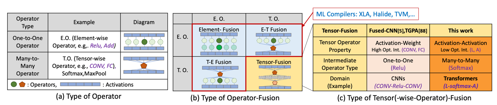

---
title: "FLAT: An Optimized Dataflow for Mitigating Attention Bottlenecks"
collection: talks
type: "Projects"
permalink: /talks/6-flat
venue: "arXiv'21"
date: 2021-09-02
location: "Atlanta, GA"
--- 
### Abstract
Attention mechanisms, primarily designed to capture pairwise correlations between words, have become the backbone of machine learning, expanding beyond natural language processing into other domains. This growth in adaptation comes at the cost of prohibitively large memory requirements and computational complexity, especially at higher number of input elements. This limitation is due to inherently limited data reuse opportunities and quadratic growth in memory footprints, leading to severe memory-boundedness and limited scalability of input elements. This work addresses these challenges by devising a tailored dataflow optimization, called FLAT, for attention mechanisms without altering their functionality. This dataflow processes costly attention operations through a unique fusion mechanism, transforming the memory footprint quadratic growth to merely a linear one. To realize the full potential of this bespoke mechanism, we propose a tiling approach to enhance the data reuse across attention operations. Our method both mitigates the off-chip bandwidth bottleneck as well as reduces the on-chip memory requirement. Across a diverse range of models, FLAT delivers 1.94x (1.76x) speedup and 49% and (42%) of energy savings compared to the state-of-the-art edge (cloud) accelerators with no customized dataflow optimization. Our evaluations demonstrate that state-of-the-art DNN dataflows applied to attention operations reach the efficiency limit for inputs above 512 elements. In contrast, FLAT unblocks transformer models for inputs with up to 64 K elements in edge and cloud accelerators.

-----------
### Paper: [FLAT: An Optimized Dataflow for Mitigating Attention Bottlenecks]( https://arxiv.org/abs/2201.11220)