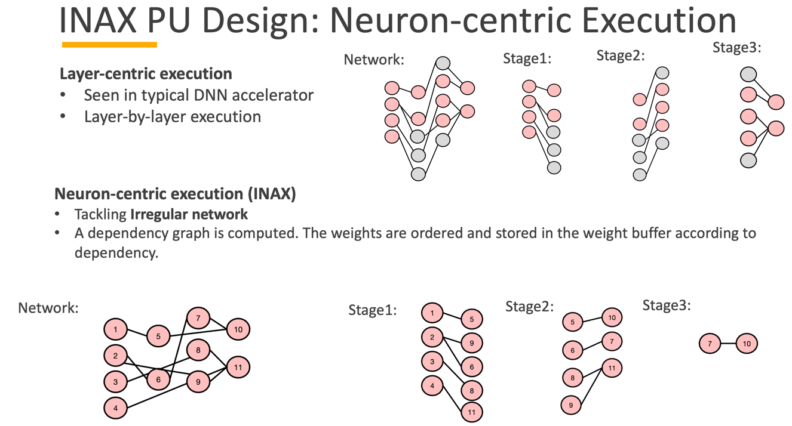

---
title: "E3: A HW/SW Co-design Neuroevolution Platform for Autonomous Learning in Edge Device"
collection: talks
type: "FPGA, Algortihm-HW co-design, Evolution Strategy, Neural Architecure Search, Edge ML"
permalink: /talks/7-e3
venue: "ISPASS'21"
date: 2021-05-02
location: "Atlanta, GA"
--- 
### Abstract
The true potential of AI can be realized once
we move beyond supervised training using labelled datasets
on the cloud to autonomous learning on edge devices. While
techniques like Reinforcement Learning are promising for their
autonomous learning ability, they exhibit high compute and memory requirements due to gradient computations, making them
prohibitive for edge deployment. In this paper, we propose E3, a
HW/SW co-designed edge learning system on a FPGA. E3 uses a
gradient-free approach called neuro-evolution (NE) to evolve the
neural network (NN) topology and weights dynamically. The NNs
evolved using NE are highly irregular, and a population of such
NNs need to be evaluated quickly in order for the NE algorithm
to make progress. To address this, we develop INAX, a specialized
accelerator inside E3 for efficient irregular network computation.
INAX leverages multiple avenues of parallelism both within and
across the evolved NNs. E3 shows averaged 30× speedup than
CPU-based solution across a suite of OpenAI environments.

------
### [Youtube]((https://www.youtube.com/watch?v=M_26Vaz30oU))

-----------
### Paper: [E3: A HW/SW Co-design Neuroevolution Platform for Autonomous Learning in Edge Device]( https://ieeexplore.ieee.org/document/9408212)
