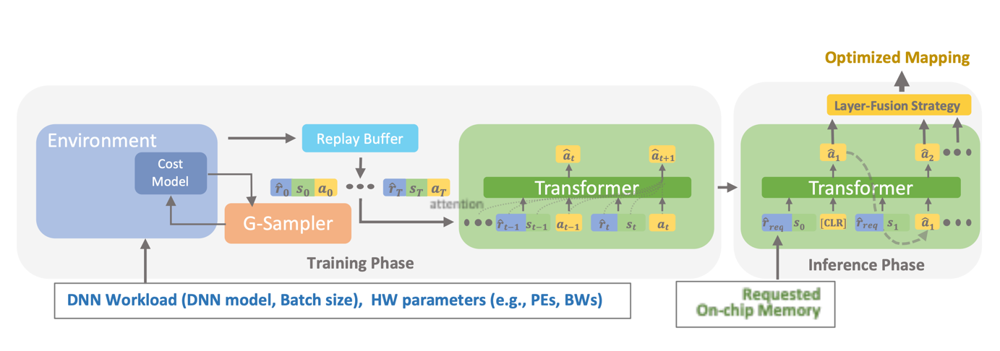

---
title: "DNNFuser: Generative Pre-Trained Transformer as a Generalized Mapper for Layer Fusion in DNN Accelerators"
collection: talks
type: "Transformers, RLs, GPT, Teacher-Student model, Knowledge Generalization, Performance Modeling, Pytorch"
permalink: /talks/8-dnnfuser
venue: "arXiv'22"
date: 2022-01-02
location: "Atlanta, GA"
--- 
### Abstract
Dataflow/mapping decides the compute and energy efficiency of DNN accelerators. Many mappers have been proposed to tackle the intra-layer map-space. However, mappers for inter-layer map-space (aka layer-fusion map-space), have been rarely discussed. In this work, we propose a mapper, DNNFuser, specifically focusing on this layer-fusion map-space. While existing SOTA DNN mapping explorations rely on search-based mappers, this is the first work, to the best of our knowledge, to propose a one-shot inference-based mapper. We leverage Transformer as our DNN architecture to learn layer-fusion optimization as a sequence modeling problem. Further, the trained DNNFuser can generalize its knowledge and infer new solutions for unseen conditions. Within one inference pass, DNNFuser can infer solutions with compatible performance to the ones found by a highly optimized search-based mapper while being 66x-127x faster.

-----------
### Paper: [DNNFuser: Generative Pre-Trained Transformer as a Generalized Mapper for Layer Fusion in DNN Accelerators]( https://arxiv.org/abs/2201.11218)
